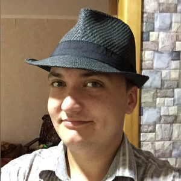

# rsschool-cv

## Alexandr Kozachenko
Male, 33 years, born on 18 October 1988
### Contacts
 +7 (777) 505-62-66  
 [murinskii@gmail.com](mailto:murinskii@gmail.com) — preferred means of communication  
 Aktobe, willing to relocate, prepared for business trips  
 ### Web Developer
 Specializations:   
      Programmer, frontend developer
### About me  
  I want to work as frontend developer. More preferable remote.  
### skills  
- HTML
- CSS, SCSS
- JavaScript (Fundamentals,Functional Programming, OOP, Asynchronous JavaScript, ES6+,DOM),JSON.
- Version control: Git (remote service GitHub).
- Module Bundlers: Gulp
- Windows OS, Linux(Ubuntu)
- Figma(for web development)
### My code example  
```
<a class="tel" href="tel:+77775051234">+77775051234</a>
        <svg class="menu-open" viewBox="0 0 100 80" width="40" height="40" fill="white">
          <rect width="100" height="20" rx=8></rect>
          <rect y="30" width="100" height="20" rx=8></rect>
          <rect y="60" width="100" height="20" rx=8></rect>
        </svg>
```  

### Work experience 11 years  
- July 2021 — currently 
  #### "stroydetal" LLP  
  Aktobe
  #### developer  
  accounting software support and development(1C)  
- February 2018 — july 2021   
  #### Aktobe Rail and Section Works LLP
  #### System administrator
  Microsoft Exchange Server Administration, Kaspersky server and Eset.
  Computer repair.
  scheduled maintenance
